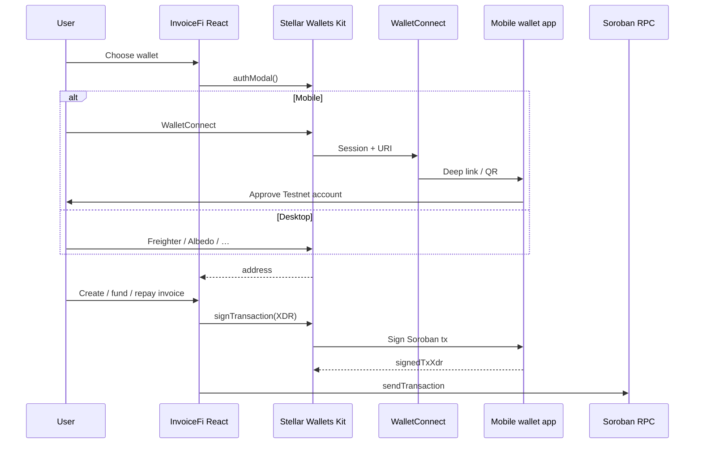

# Mobile wallet support (Stellar Wallets Kit)

InvoiceFi targets mobile-first users. Desktop users can rely on the Freighter browser extension; mobile browsers cannot install extensions, so we integrated **[Stellar Wallets Kit](https://stellarwalletskit.dev/)** with **WalletConnect** for pairing wallet apps on iOS and Android.

## What we built

| Layer | Role |
|-------|------|
| `@creit.tech/stellar-wallets-kit` | Unified connect + sign API for Freighter, Albedo, Lobstr, xBull, WalletConnect, and other Stellar wallets |
| `src/utils/walletKit.ts` | One-time kit init, module list, connect/disconnect/sign helpers |
| `src/utils/stellar.ts` | Horizon balances + routes `connectWallet` / `signTransaction` through the kit |
| `src/hooks/useWallet.tsx` | React context: session restore, kit events, mobile / WalletConnect flags |
| `ConnectWalletModal.tsx` | Branded intro; **Choose wallet** opens the kit’s built-in wallet picker |

### Connect flow

1. User taps **Connect wallet** or **Choose wallet**.
2. `StellarWalletsKit.authModal()` opens the kit UI (wallet list).
3. User picks a wallet:
   - **Desktop:** Freighter extension, Albedo, Lobstr, etc.
   - **Mobile:** **WalletConnect** → QR / deep link → approve in Freighter, xBull, or another WC-compatible Stellar wallet.
4. Kit returns the public key; we verify **Stellar Testnet** passphrase before saving state.
5. Soroban writes call `StellarWalletsKit.signTransaction()` with the connected address.

### Disconnect / switch

- **Disconnect** calls `StellarWalletsKit.disconnect()` and clears React state.
- **Switch wallet** disconnects then runs `authModal()` again.

## Configuration

Add to `frontend/.env` (see `.env.example`):

```bash
# Required for mobile WalletConnect pairing
VITE_WALLET_CONNECT_PROJECT_ID=your_reown_project_id
```

1. Create a free project at [Reown Cloud](https://cloud.reown.com/) (formerly WalletConnect Cloud).
2. Copy the **Project ID** into `VITE_WALLET_CONNECT_PROJECT_ID`.
3. Restart the Vite dev server.

If this variable is **empty**, the WalletConnect module is not registered. Mobile users can still use wallets that open the site in an **in-app browser** (Freighter / Lobstr mobile browser, etc.), but QR-based pairing will not appear.

Other env vars (unchanged): `VITE_NETWORK_PASSPHRASE`, Soroban RPC, contract addresses.

## Architecture (high level)



## Files to know

- `frontend/src/utils/walletKit.ts` — init, WalletConnect module, connect/sign/disconnect
- `frontend/src/utils/device.ts` — `isMobileBrowser()` for UI hints
- `frontend/src/config.ts` — `WALLET_CONNECT_PROJECT_ID`, `APP_METADATA`
- `frontend/src/hooks/useWallet.tsx` — app-wide wallet state
- `frontend/vite.config.ts` — `optimizeDeps` for kit packages

## Testing

### Desktop

1. Set `.env` (WalletConnect id optional but recommended).
2. `npm run dev` in `frontend/`.
3. Connect → pick **Freighter** → approve Testnet.
4. Run a dashboard action that signs (e.g. create invoice) and confirm Freighter prompts.

### Mobile (iOS / Android)

1. Deploy or use a **HTTPS** URL (or LAN HTTPS tunnel). WalletConnect is unreliable on plain `http://` except localhost.
2. Set `VITE_WALLET_CONNECT_PROJECT_ID`.
3. On the phone, open the app → **Choose wallet** → **WalletConnect**.
4. Select your installed wallet, approve connection on **Testnet**, then try connect + one sign flow.

### Without WalletConnect

- Open the deployed site inside **Freighter’s** or **Lobstr’s** in-app browser; the kit should detect the wrapper and offer that wallet.

## Limitations and notes

- **Testnet only** in this app: kit network is `Networks.TESTNET`; wrong network in the wallet is rejected after connect.
- **WalletConnect** must be configured for the best mobile UX; without it, users depend on in-app browsers or desktop extensions.
- Kit UI (picker modals) is styled with `SwkAppLightTheme`; our `ConnectWalletModal` is only the explanatory shell before the kit modal.
- Private keys never touch InvoiceFi; only public keys and signed XDRs.
- Package name on npm is `@creit.tech/stellar-wallets-kit` (docs often show `@creit-tech/...` — same library, different registry alias).

## Troubleshooting

| Symptom | Check |
|---------|--------|
| No WalletConnect in picker | `VITE_WALLET_CONNECT_PROJECT_ID` set and dev server restarted |
| “Wrong network” after connect | Wallet set to **Testnet** (not Mainnet) |
| Sign fails on mobile | Same account connected; wallet app updated; retry after unlocking wallet |
| Build slow / large bundle | Expected: WC + kit pull in Reown/WalletConnect deps; use production build for real perf testing |

## References

- [Stellar Wallets Kit docs](https://stellarwalletskit.dev/)
- [Wallet Connect module](https://stellarwalletskit.dev/wallets/wallet-connect.html)
- [Reown Cloud](https://cloud.reown.com/)
- [Freighter](https://www.freighter.app/)
